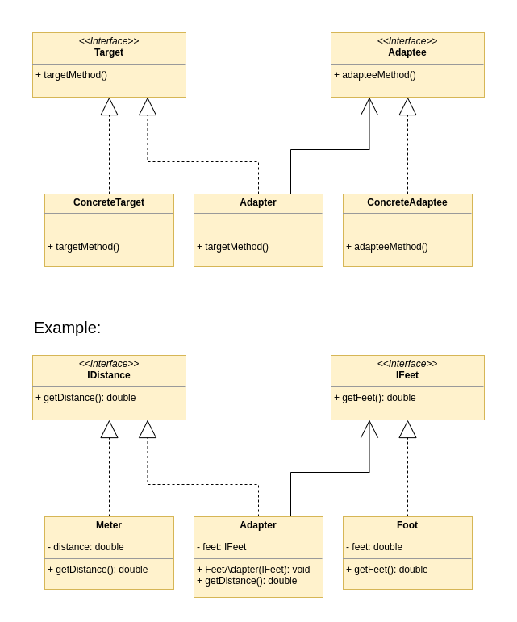

[Index](../../README.md)
# Adapter

This pattern allows objects with incompatible interfaces to collaborate. 
The adapter is an object that converts the interface of one object so that another object can understand it.

## The problem

Imagine to have  

## The solution

## UML

### Links

[Refactoring Guru](https://refactoring.guru/design-patterns/adapter) 
