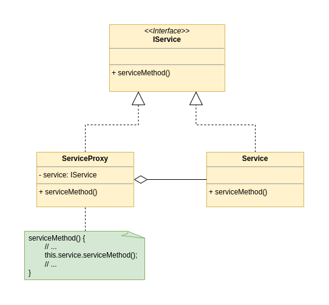

[Index](../../README.md)
# Proxy
The proxy is a design pattern that lets you add some additional behavior to an already existing implementation of a given interface.<br />


## The problem
Imagine an interface and his implementation already exist, but we cannot modify neither of them (either because they belong to a third party library or is already used in our code, and we don't want to modify existing code).<br />
Still we need to execute some business logic before or after a certain method of the service is called.

## The solution
We create a ```ServiveProxy``` class that implements the same interface of the service: ```IService``` in our case.<br />
The new class has as internal parameter an instance of ```IService```; this instance may be passed by a constructor (in that case the client is aware of using the proxy version of the implementation, and it may choose if to use it or to use the real service instead) or created internally (doing so the client cannot choose witch implementation to use).<br />
In the implementation of the ```ServiveMethod()``` in the ```ServiveProxy``` class, before or after executing the real service method (by delegation) we can execute some extra code.
<br />
<br />
Keep in mind that is not always possible to implement the same interface of the real service, it may don't exist; in that case you can extend the service and override the method you need.

## UML



### Links

[Refactoring Guru](https://refactoring.guru/design-patterns/proxy)<br />
