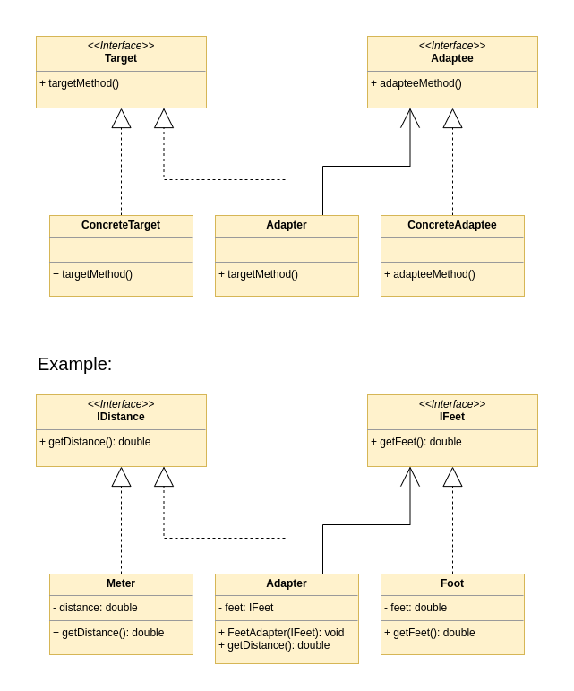

[Index](../../README.md)
# Adapter

This pattern allows objects with incompatible interfaces to collaborate.<br />
The adapter is an object that converts the interface of one object so that another object can understand it.

## The problem

Imagine to have an ```IDistance``` interface with a method ```getDistance()```;<br />
The concrete class ```Meter``` implements the interface and his implementation of the method ```getDistance()``` returns the distance in meters.<br />
We also have the interface ```IFeet``` with the method ```getFeet()```;<br />
The concrete class ```Foot``` implements the interface and his implementation of the method ```getFeet()``` returns the distance in feet.<br />
Now we want to use the ```Meter``` class in a context where the ```Foot``` class is used. We can't do it because the two classes have different interfaces.<br />
We need an adapter!

## The solution

The solution is to create an adapter class that we'll call ```FeetAdapter``` that implements ```IDistance``` (the target).<br />
The ```FeetAdapter``` class has a reference to the ```IFeet``` interface (the adaptee) and implements the method ```getDistance()``` of the ```IDistance``` interface.<br />
The implementation of the method ```getDistance()``` of the ```FeetAdapter``` class converts the distance in feet to meters and returns it.

## UML



### Links

[Refactoring Guru](https://refactoring.guru/design-patterns/adapter)<br />
