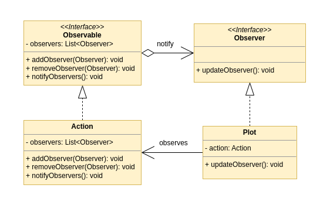

[Index](../../README.md)
# Observer

## The problem

We have two objects: an Action and a Plot.<br />
We want to update the plot when the action changes.<br />
We could periodically check the action and update the plot if it has changed, but this is inefficient because most of the requests wont produce any change in the plot.

## The solution

The action can store a list of object that are interested in its changes.<br />
When the action changes, it can notify all the objects in the list.<br />
So at every change of the action we call the method ```updateObserver()``` of every object listening for changes.<br />

## UML



### Links

[Refactoring Guru](https://refactoring.guru/design-patterns/observer)<br />
